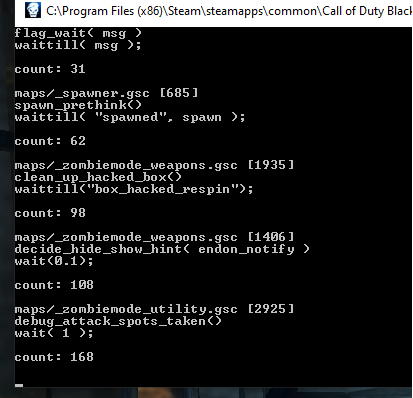

# BO1-DEBUGGER

---

A DLL that dumps the position of the running script threads.

  

---

## Contents

**[Why?](#1why)**

**[Installation](#installation)**

**[Using the debugger](#using-the-debugger)**

**[Misc.](#misc)**

**[Credits and sources](#credits-and-sources)**

---

### Why?

Using this allows you to easily see any leaks of threads. I am not sure if other variable types can leak, although I believe it is most likely that threads not being ended is the cause of all of them. The program can perform basic analysis on the thread positions to give the counts of duplicate threads, note that their being a lot of duplicate threads does not mean there is necessarily a leak. For example there is always over 100 duplicates of `debug_attack_spots_taken()`.

### Installation

1. Download the release from github. This contains both `bo1-debugger.dll` and an executable to inject it. If you have a different injector you'd like to use it will work fine.
2. Place `bo1-debuggers.dll` in the same folder as `BlackOps.exe`, if it is anywhere else it will not work.
3. Launch `BlackOps.exe`.
4. Once you reach the main menu you can launch the executable to inject `bo1-debugger.dll`. The executable can be placed anywhere.
5. If the console opens you know it has injected correctly.

### Using the debugger

Once the dll is injected an external console will be added to Black Ops, this is used to print the thread debug information. The in-game console will also be enabled and is used to dump thread info with the following commands:

- dumpthreads - dump the position of every thread in the external console.
- dumpthreadsa - dump the position of every thread, and count the duplicates of each thread (this is the most useful for finding leaks).
- dumpthreadsf - same as dumpthreads but also prints to `"thread_dump.txt"` which is placed in the Black Ops folder.
- dumpthreadsaf - same as dumpthreadsa but also prints to `"thread_dump.txt"` which is placed in the Black Ops folder.

The dump includes the location in source code of each `wait`/`waittill` thread, which combined with the gsc (see [t5-scripts](https://github.com/plutoniummod/t5-scripts/)) should allow you to find the cause and potential ways around any leaks. You can either play normally for a while and see if there are any threads with a lot of duplicates, or test specific things to see if it adds any permanent threads.

### Misc.

- Either the executable or dll will almost definitely be detected as a virus, this is just due to how DLL injection works. If you care that much build it yourself from the source code.

- The DLL is not super stable, if you launch it during the load screen the game could crash.

- The debugger will only work after you have loaded a map with it already injected, as otherwise the source code will not have been into the buffers.

---

### Credits and sources

The addresses, and datatypes were mainly found using the leaked server .pdb and Ghidra, however without these repositories this would have taken much longer to make:

- [CoD4x_Server](https://github.com/callofduty4x/CoD4x_Server/) - very useful as many parts of the engine have not changed since COD4.
- [LinkerMod](https://github.com/Nukem9/LinkerMod) - patches to enable console and CEG patches.
- [t5-gsc-utils](https://github.com/fedddddd/t5-gsc-utils/) - general structs and addresses.
